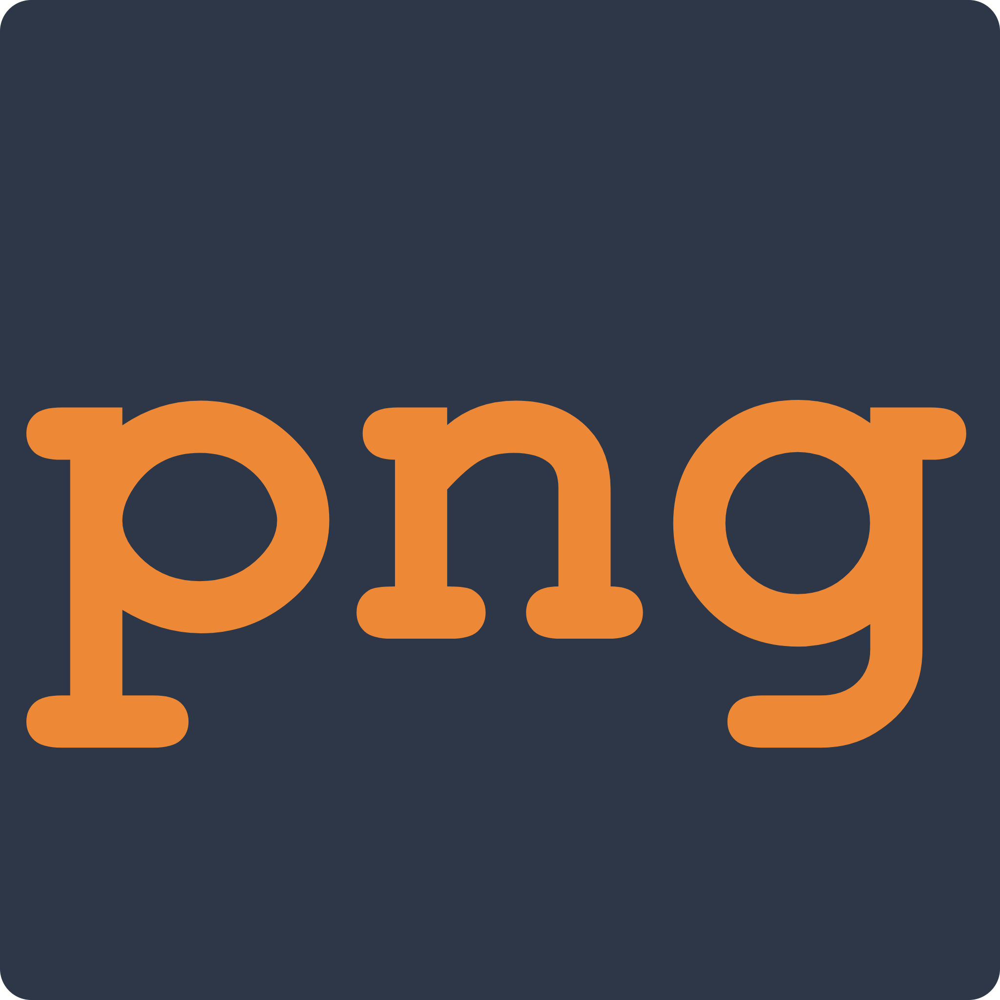

<div align="center">
    
    <h1>GetWeb Screenshot</h1>
    <p>A modern web application for capturing high-quality website screenshots instantly.</p>
</div>

---

# 📸 GetWeb Screenshot

GetWeb Screenshot is a sleek, premium, and fully responsive web-based application designed to capture high-quality screenshots of any webpage instantly. Powered by React, Vite, and the Microlink API, it delivers a gorgeous glassmorphic interface with robust download and export options.

---

## ✨ Features

- **Instant Captures:** Fetch full-page screenshot previews in seconds simply by pasting a URL.
- **Device Viewport Presets:** Quick-toggle layout widths matching standard device dimensions:
  - 🖥️ **Desktop** (1920px)
  - 📁 **Tablet** (768px)
  - 📱 **Mobile** (375px)
- **Custom Viewport Control:** Manually specify pixel widths to test layouts at any breakpoint.
- **Multiple Formats:** Capture and save screenshots in high-fidelity **PNG** or optimized **JPG**.
- **Cors-Safe Image Downloads:** Safe, local downloads utilizing a proxy helper to ensure reliable file downloads.
- **Export to PDF:** Instantly generate a printable PDF version of your captured webpage.
- **Modern Premium UI/UX:** Stunning glassmorphism styling built with vanilla CSS variables, interactive micro-animations, loading skeletons, and fluid transition effects.

---

## 🛠️ Technology Stack

- **Framework:** React 19
- **Build Tool:** Vite 6
- **Linter:** ESLint 9
- **Icons:** Lucide React
- **Styles:** Custom Vanilla CSS (featuring CSS Custom Properties for theme tokens)
- **API Engine:** Microlink API (for cloud-based screenshot generation)

---

## 🚀 Getting Started

Follow these steps to run the project locally on your machine.

### Prerequisites

Ensure you have [Node.js](https://nodejs.org/) installed (version 18+ is recommended).

### 1. Clone the repository & Navigate
```bash
git clone https://github.com/khxayan/GetWeb_Screenshot.git
cd GetWeb_Screenshot
```

### 2. Install dependencies
```bash
npm install
```

### 3. Start the development server
```bash
npm run dev
```
The application will start, configured to run locally on **port 3000** at **`http://localhost:3000`**.

### 4. Build for production
```bash
npm run build
```

### 5. Lint the codebase
```bash
npm run lint
```

### 6. Preview the production build locally
```bash
npm run preview
```

---

## 📂 Project Structure

```text
GetWeb_Screenshot/
├── .github/
│   └── dependabot.yml      # GitHub Dependabot configuration
├── public/                 # Static assets
│   └── favicon.png         # Site favicon
├── src/
│   ├── App.css             # Supplementary template styles
│   ├── App.jsx             # Core application layout, state, and API logic
│   ├── index.css           # Styling system & glassmorphism theme rules
│   └── main.jsx            # React root mount point
├── .gitignore              # Git ignore file
├── eslint.config.js        # ESLint configuration
├── index.html              # HTML shell
├── LICENSE                 # MIT License file
├── package-lock.json       # Dependency lockfile
├── package.json            # Scripts & dependencies
├── README.md               # Project documentation
├── vercel.json             # Vercel deployment configuration
└── vite.config.js          # Vite build configuration (locked to port 3000)
```

## 🚀 Live Demo

The project is deployed and hosted on **Vercel**! Feel free to visit the live version:
🔗 **[https://getweb-screenshot.vercel.app/](https://getweb-screenshot.vercel.app/)**

---

## 📄 License

This project is licensed under the **MIT License** - see the [LICENSE](LICENSE) file for details.

---

---
